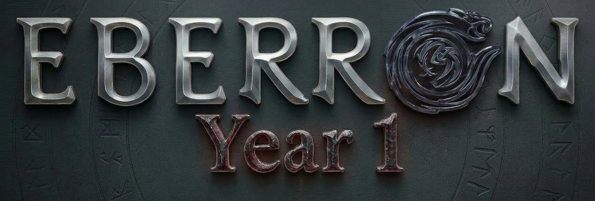

    

This is the online repository for rules to play the Eberron Year 1 Homebrew. This abbreviated rulebook is divided into the Rulebook sections, which displays the unique/updated mechanics used for play, and the Settings section which contains information about this specific version of Eberron's timeline and non-canonical updates to its lore over the course of the campaign.
