# Days, Weeks, Years - The Lunar Cycles and Seasons

It is a long year for the residents of Icara – a years cycle takes around four-hundred and eighty six days. 
This cycle takes along 18 months, divided into 4 long seasons. There is a very long growing season in Icara, and generally several crops can be brought to fruition during that period. 
Conversely, there is a very long winter season, and those that cannot store enough food for that long winter are often brought to famine.

## Lunar Cycle

The weeks and months are roughly planned by the lunar cycles of the quicker two of the three moons that circle Icara. 
**Isara**, the Traveler, glides quickly through the skies, its cool blue light offering illumination on roughly half of all nights. 
Most travelers can quickly determine the day by its lunar cycle. 
**Elysian**, the Lantern, a bright white moon that cycles over the course of the month, gives similar guidance. 
**Mogar**, the Silent, slowly phases in and out, but even when directly lit, the black surface sheds little to no light upon the surface.

## Seasons and Months

The seasons are split into the spring months of **Kaori**, **Sappara**, **Akamas** and **Gaidala**. 
The summer months are **Salar**, **Senegalar**, **Meldari** and **Pyrsa**, culminating in the summer solstice and festival season of **Sylfyri**. 
The long autumn contains the months **Avizeri**, **Kheperi**, **Soleis** and **Divisara**, 
which bleed into the cold months of winter; **Moharsa**, **Anemis**, **Shiaviri** and **Laisiri**. 
The last month of the year, that of the winter solstice, is the dark and dread **Thanata**, often known as the starving month for barbarian tribes and farming communities who have not stored enough.

## Weekdays

The weekdays (of which there are nine) were worded in ancient dwarven. **Meursdoun**, **Stredoun**, **Hierthdoun**, **Sherpdoun**, **Firgdoun**, **Thanedoun**, **Jagdsdoun**, **Torsdoun** and **Odoun** are all based on days of the traditional dwarven workweek. 
In common, these are occasionally shortened to **Milday**, **Streday**, **Herthday**, **Sherday**, **Firgday**, **Kinsday**, **Trekday**, **Feaday** and **Godsday**.  
Formally, however, most use the ancient dwarven, as it was adopted by both the Elder races and many of the ancient human kingdoms centuries ago.

## Spring

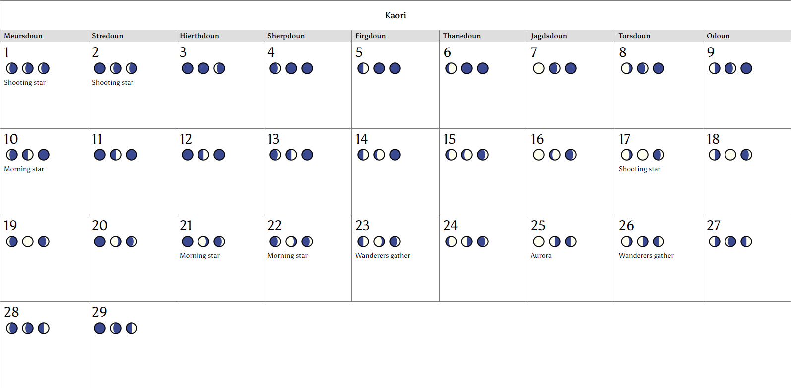
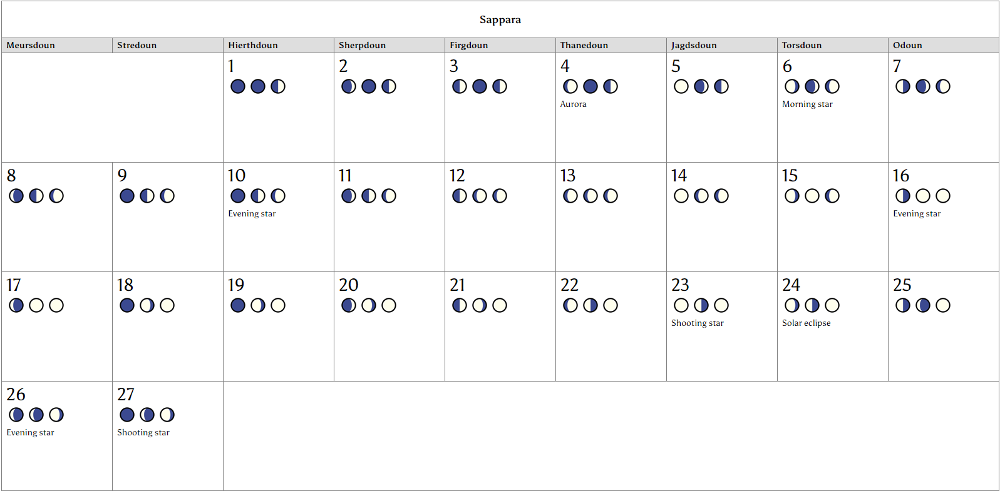
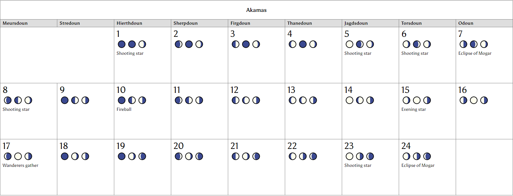
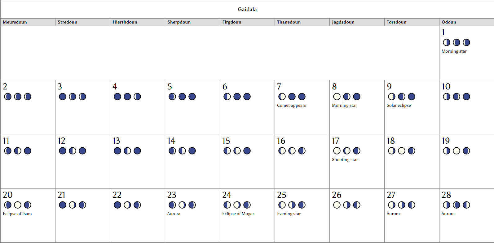

## Summer

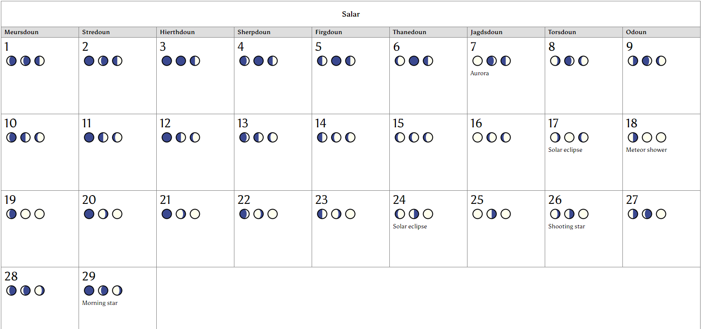
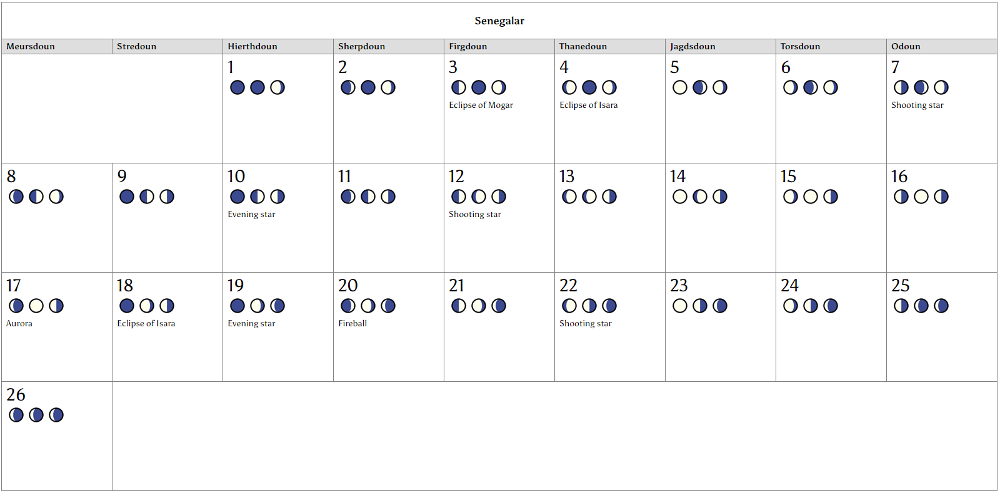
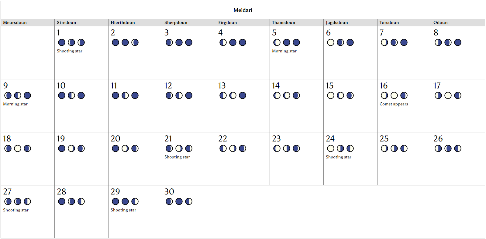
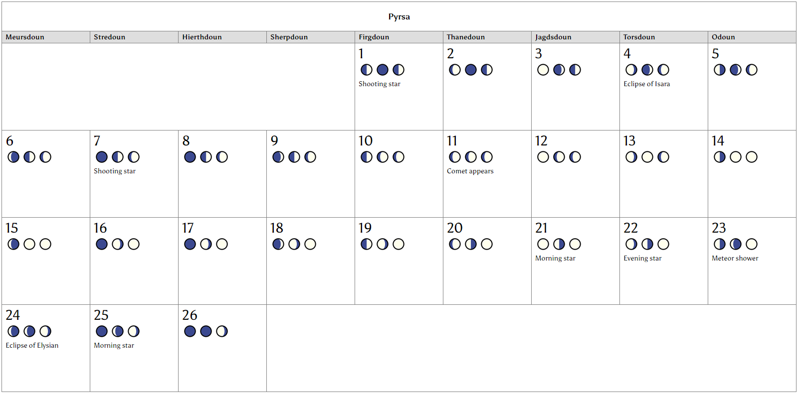
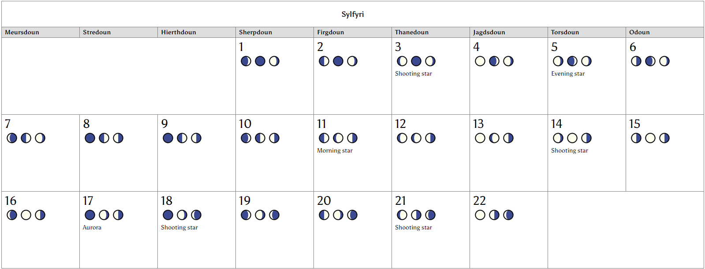

## Fall

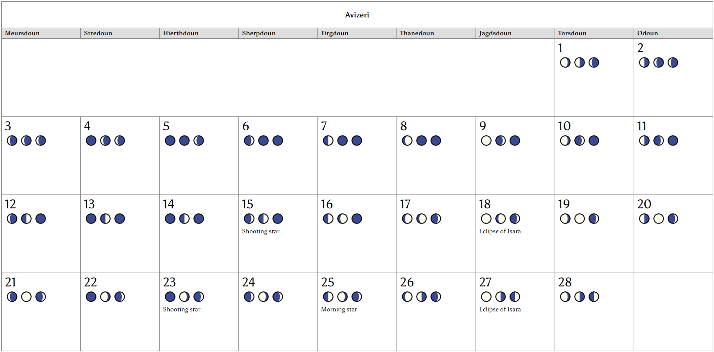
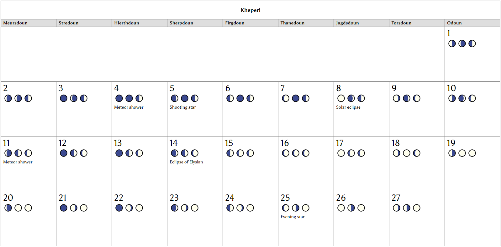
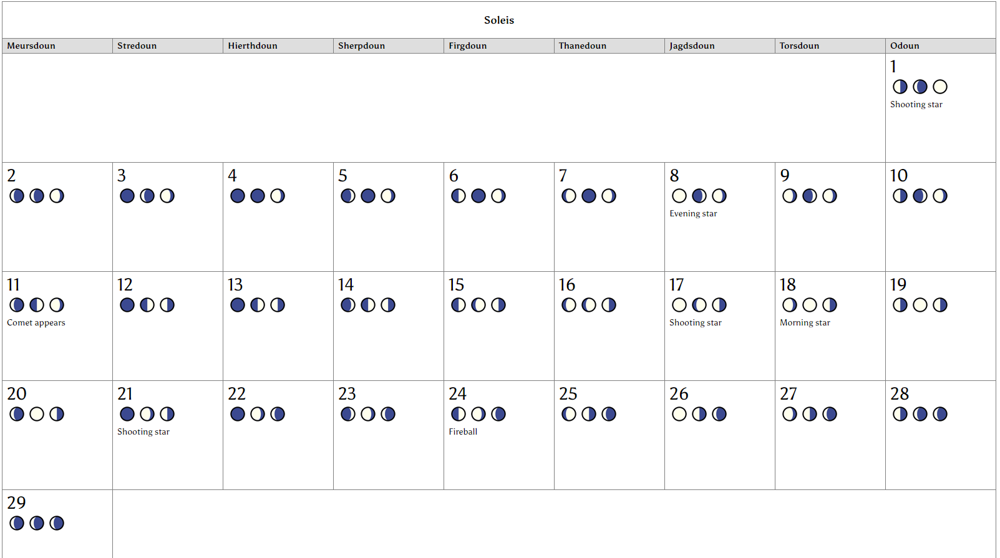
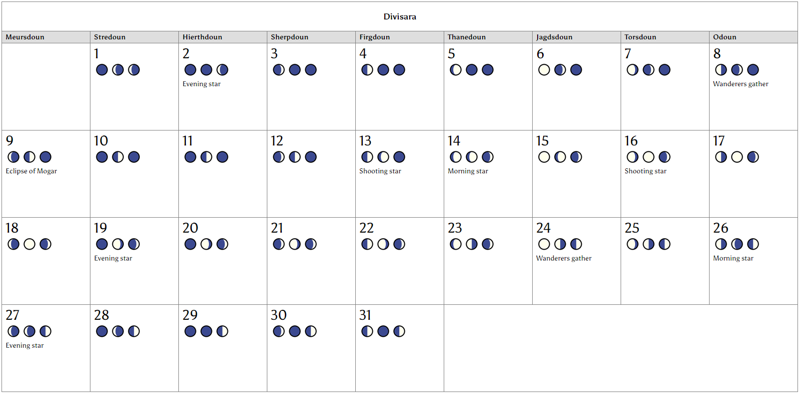

## Winter

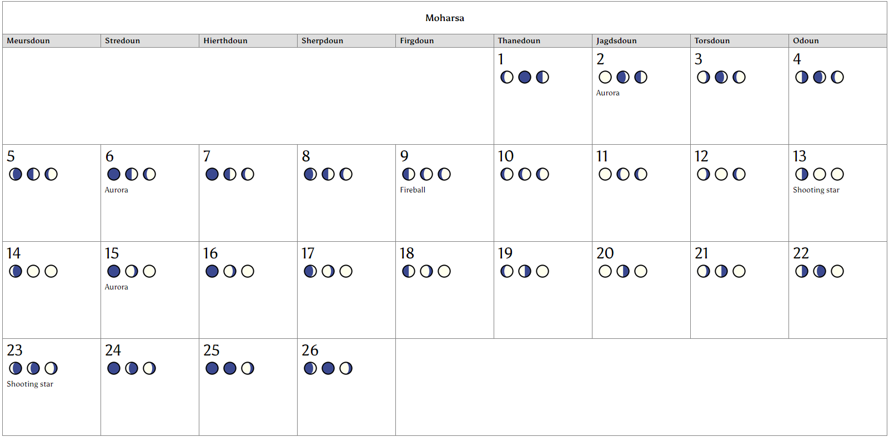
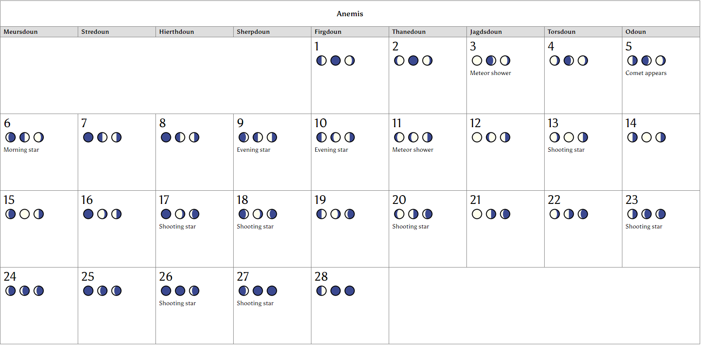
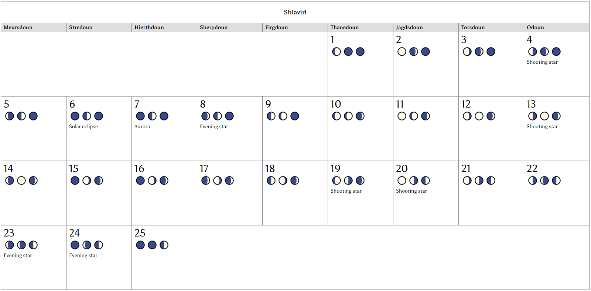
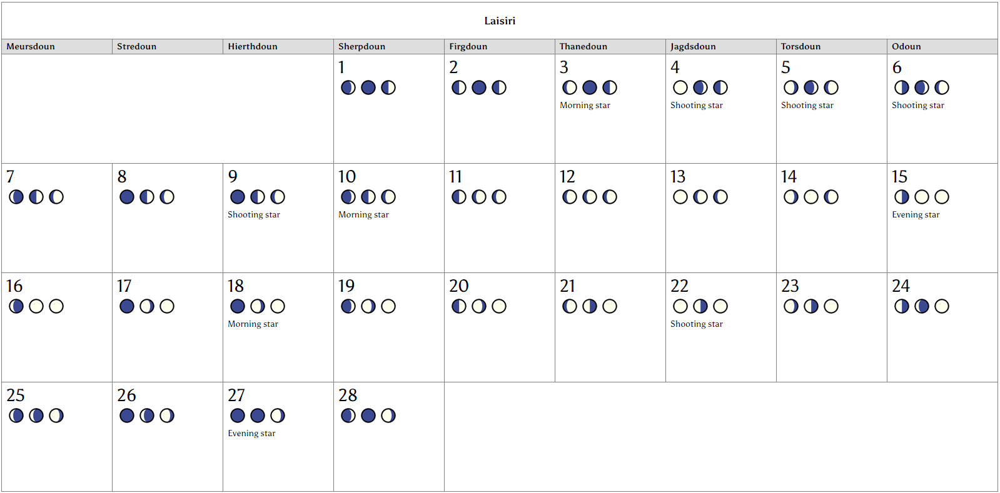
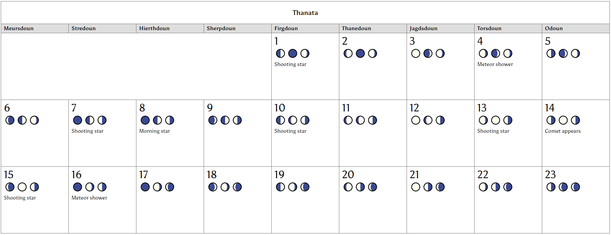
